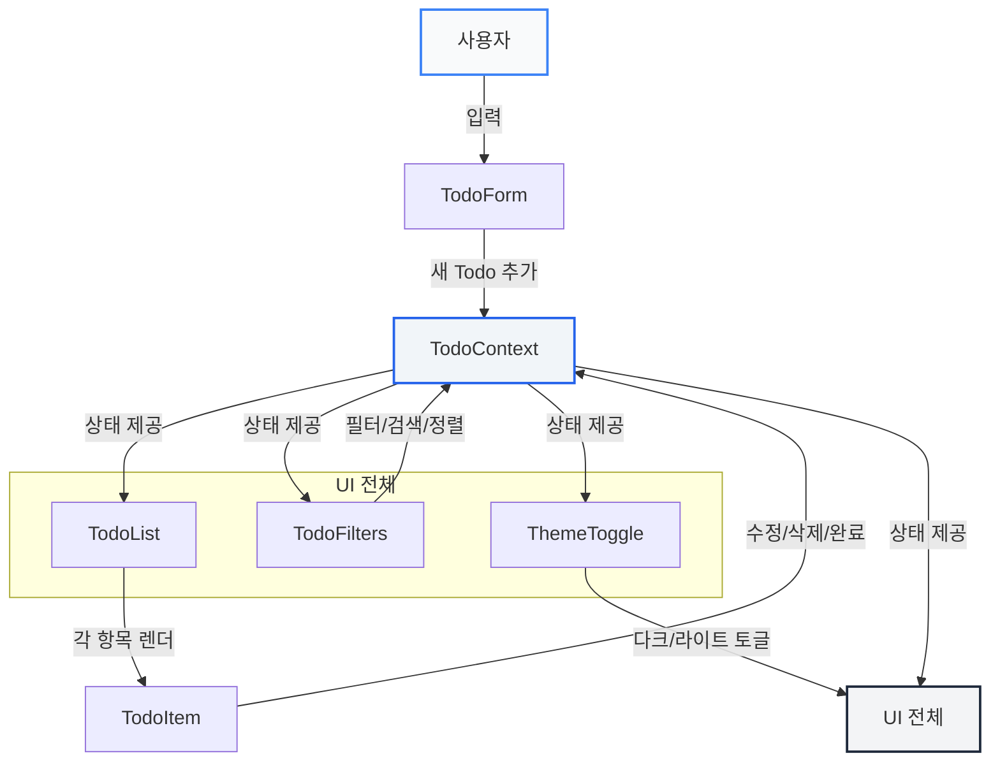

# TODO 웹앱 설계도 및 다이어그램

## Mermaid 다이어그램

---

## 각 요소 설명

- **사용자**: 실제로 앱을 사용하는 사람
- **TodoForm**: 할 일 입력 및 추가 폼
- **TodoContext**: 앱의 상태(할 일 목록, 필터, 정렬 등) 중앙 관리
- **TodoList**: 할 일 목록을 렌더링
- **TodoItem**: 개별 할 일 항목(수정/삭제/완료 가능)
- **TodoFilters**: 필터, 검색, 정렬 UI
- **ThemeToggle**: 다크/라이트 모드 전환
- **UI 전체**: 모든 화면 요소(Theme 반영) 